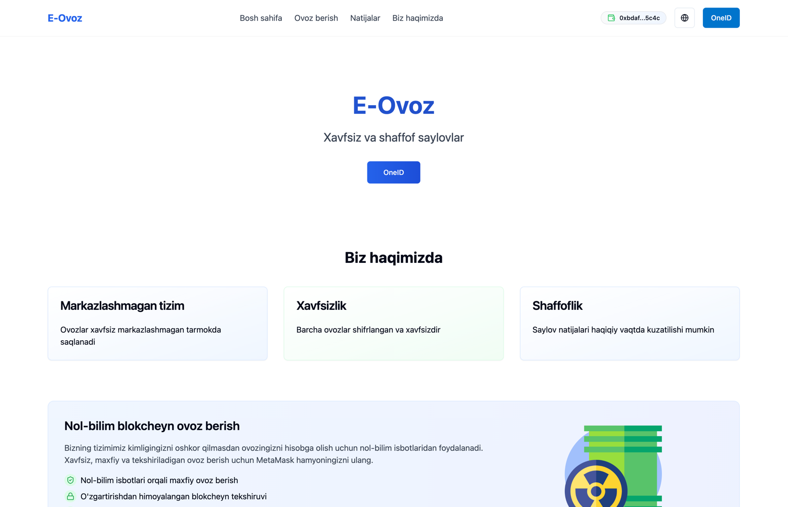
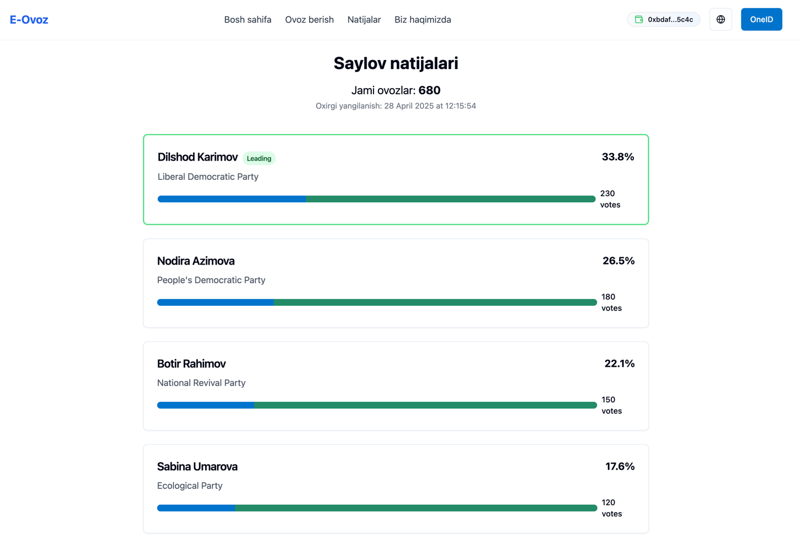
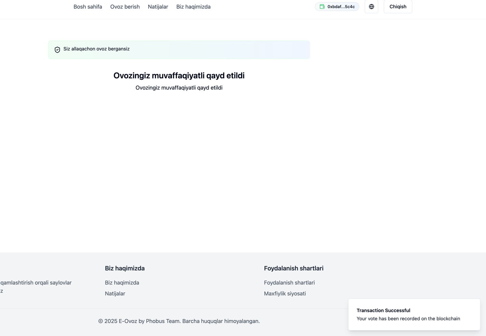
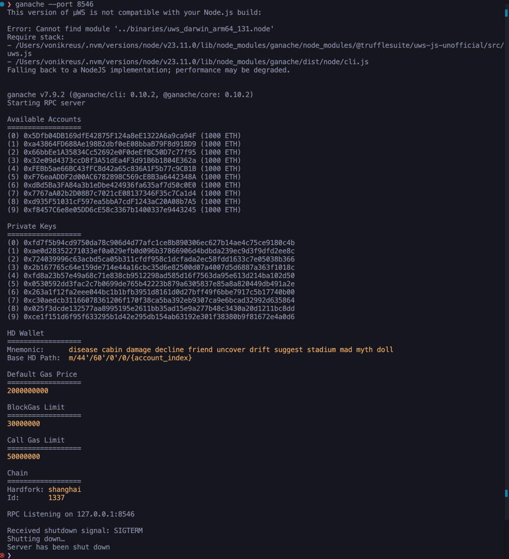

# E-Ovoz : Blokchaynga asoslangan ovoz berish tizimi

A decentralized application for secure and transparent government elections. This project was created for a hackathon to demonstrate blockchain-inspired voting technology.


 





## Features

- Multi-lingual support (Uzbek, Russian, English)
- Secure voter authentication
- Transparent vote recording using decentralized principles
- Real-time results dashboard
- Mobile-responsive design

## Prerequisites

- metamask extension in your browser (browser must be compatible with metamask)
- Ganache
- Truffle

## Technologies Used

- React
- TypeScript
- Truffle
- Ganache
- Tailwind CSS
- i18n for internationalization
- React Router for navigation

## Getting Started

```bash
# Install dependencies
npm install

# Run development server
npm run dev
```

## Project Structure

- `src/components` - Reusable UI components
- `src/context` - React context providers for app state
- `src/i18n` - Internationalization configuration and translations
- `src/pages` - Application pages

## Demo Credentials

For demonstration purposes, you can use these credentials:
- ID: 1234567890, Password: password1
- ID: 2345678901, Password: password2

## Security Features

This application simulates blockchain-based vote recording with:
- Encrypted vote storage
- Immutable vote records
- Distributed verification

## License

Copyright © 2025 Phobus Team. All rights reserved.
