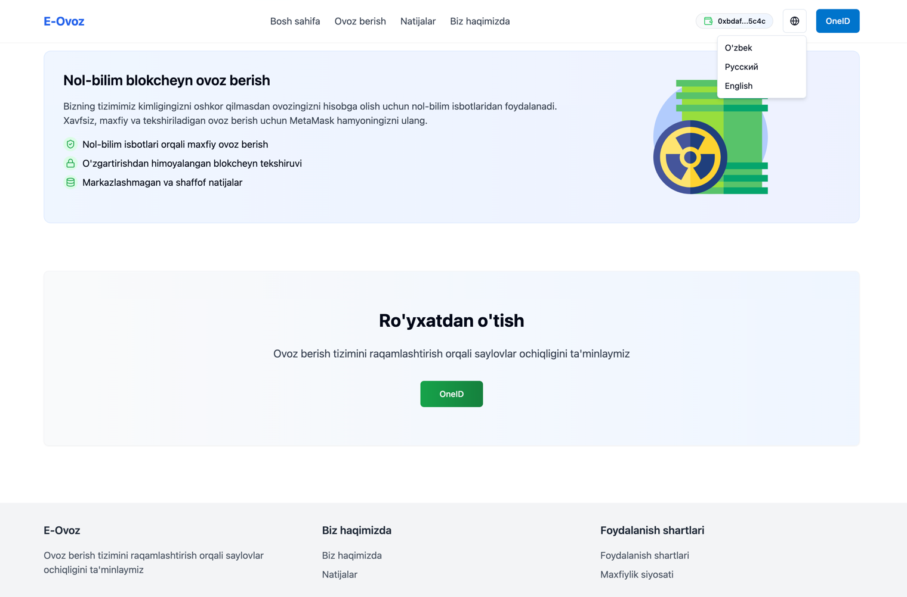
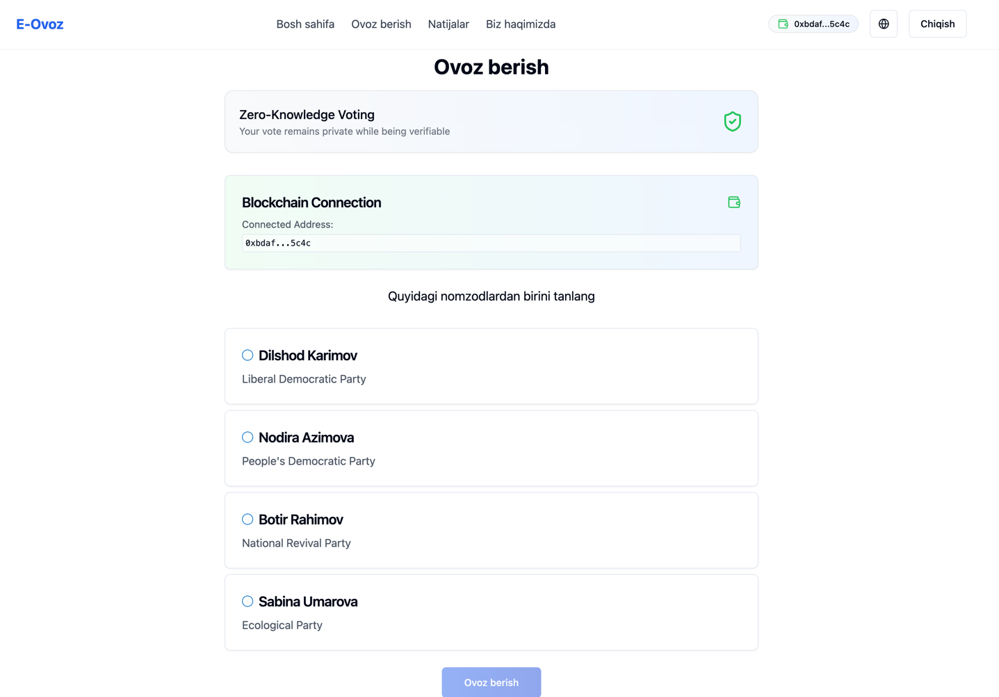

# E-Ovoz : Blokchaynga asoslangan ovoz berish tizimi

A decentralized application for secure and transparent government elections. This project was created for a hackathon to demonstrate blockchain-inspired voting technology.


 



## Features

- Multi-lingual support (Uzbek, Russian, English)
- Secure voter authentication
- Transparent vote recording using decentralized principles
- Real-time results dashboard
- Mobile-responsive design

## Prerequisites

- metamask extension in your browser (browser must be compatible with metamask)
- Ganache
- Truffle

## Technologies Used

- React
- TypeScript
- Truffle
- Ganache
- Tailwind CSS
- i18n for internationalization
- React Router for navigation

## Getting Started

```bash
# Install dependencies
npm install

# Run development server
npm run dev
```

## Blockchain Setup (Truffle + Ganache)
### 1. Install Ganache CLI
```bash
npm install -g ganache
```
### or download Ganache Desktop.

### Start Ganache on a separate terminal:

```bash
ganache
```
### Ganache will provide Ethereum accounts with private keys for local development.

### 2. Install Truffle

```bash
npm install -g truffle
```
### 3. Compile Smart Contracts

```bash
truffle compile
```
### 4. Deploy Smart Contracts Locally

```bash
truffle migrate --network development
```
### Default Ganache configuration for Truffle (truffle-config.js):

```javascript
module.exports = {
  networks: {
    development: {
      host: "127.0.0.1",
      port: 8545,
      network_id: "*", // Match any network id
    }
  },
  compilers: {
    solc: {
      version: "0.8.20", // Match your smart contract version
    }
  }
};
```

## Project Structure

- `src/components` - Reusable UI components
- `src/context` - React context providers for app state
- `src/i18n` - Internationalization configuration and translations
- `src/pages` - Application pages

## Demo Credentials

For demonstration purposes, you can use these credentials:
- ID: 1234567890, Password: password1
- ID: 2345678901, Password: password2

## Security Features

This application simulates blockchain-based vote recording with:
- Encrypted vote storage
- Immutable vote records
- Distributed verification

## License

Copyright © 2025 Phobus Team. All rights reserved.
